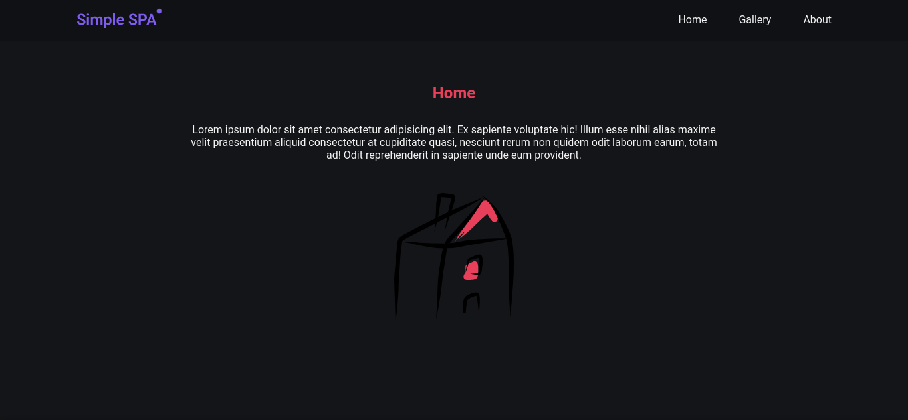
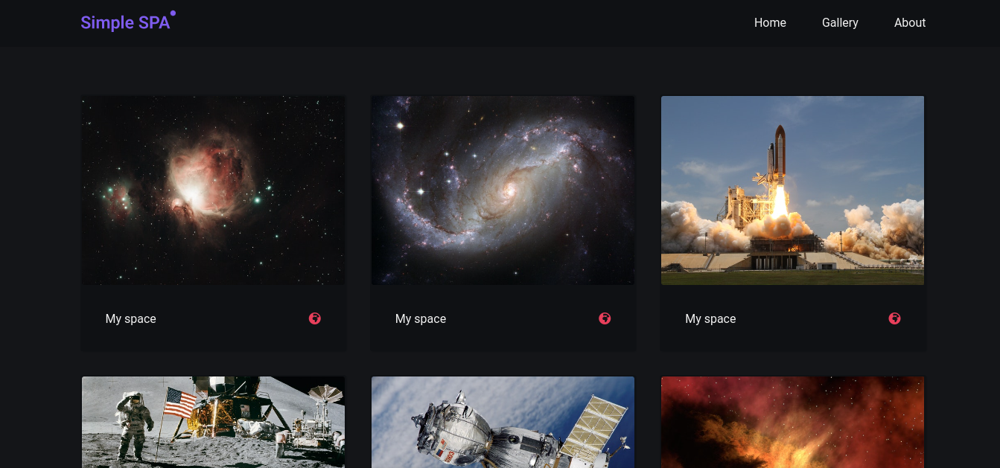

### Single Page Application

<div>
    
    
</div>

<p>Um simples projeto que mostra a implementação web Single Page Application, que consiste numa única página que carrega diversos conteúdos por meio de APIs Javascript, como fetch ou XMLHttpRequest, o projeto foi desenvolvido com HTML5, CSS3, Javascript, incluindo algumas ferramentas, como, webpack e babel.</p>


<br/><br/>


### Executando ⚙️

```sh
# Website: https://simplesinglepageapp.netlify.app/

# Clone
$ git clone git@github.com:EricNeves/Simple-SPA.git

# Install Dependencies
$ cd Simple-SPA && npm install

# Execute
$ npm start
# Run mode development 
$ npm run dev
# Build
$ npm run build
```

### Ferramentas 🛠

   * HTML5
   * CSS3
   * Javascript
   * NodeJS
     * [Express]('https://expressjs.com/')
     * [Webpack]('https://webpack.js.org/')
     * [Babel]('https://babeljs.io/')

### License

